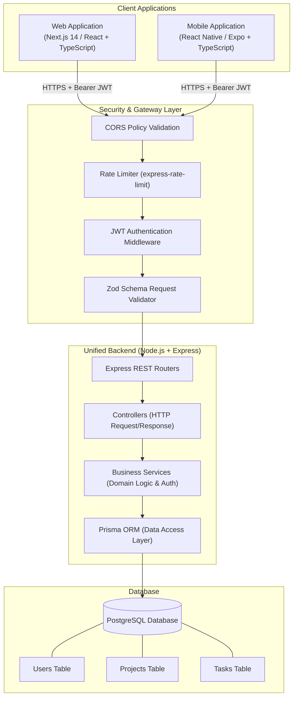
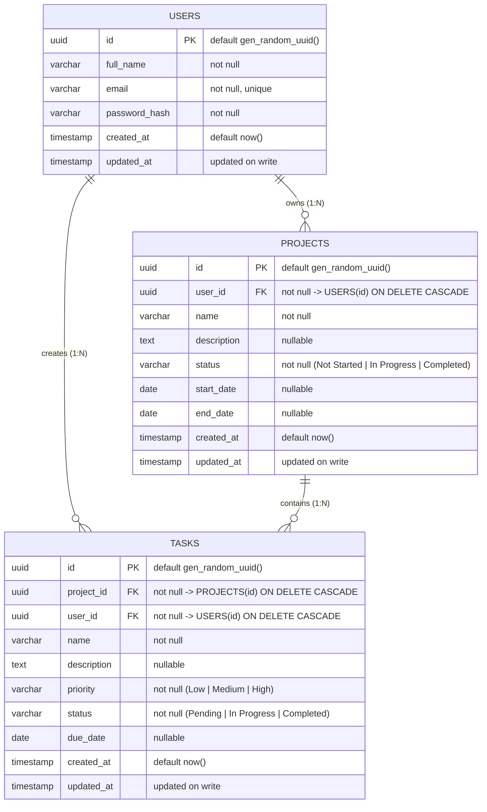

# System Architecture & Technical Design Document
## Project Management System (Web + Mobile)

---

## 1. System Overview & Architecture Diagram

The Project Management System is structured as a **unified multi-client client-server architecture**. Both Web and Mobile clients consume a single, authoritative Node.js/Express REST API backed by a PostgreSQL relational database.



---

## 2. Technology Stack Selection & Rationale

As mandated by the project requirements, selections were made from the allowed technical options:

| Component | Selected Technology | Version / Tooling | Rationale & Justification |
| :--- | :--- | :--- | :--- |
| **Backend** | **Node.js + Express (TypeScript)** | Node 20 LTS, Express 4.x, TS 5.x | High-throughput, lightweight, mature ecosystem. Express paired with strict TypeScript provides clear route separation, custom middleware pipelines, and rapid response times without NestJS boilerplate overhead. |
| **Database** | **PostgreSQL** | PostgreSQL 16 | ACID-compliant, robust relational integrity, native UUID support, and exceptional indexing capabilities for multi-tenant foreign key lookups. |
| **ORM** | **Prisma ORM** | Prisma 5.x | Type-safe query builder, automated migrations, declarative schema definitions, and automated SQL injection prevention via prepared parameterization. |
| **Web Frontend** | **Next.js (App Router)** | Next.js 14+, React 18/19, Tailwind CSS | Enterprise-grade SSR/CSR flexibility, file-based routing, instant bundle optimization, responsive mobile-friendly layouts, and first-class TypeScript support. |
| **Mobile App** | **React Native (Expo)** | Expo SDK 51+, Expo Router, TypeScript | Cross-platform targeting (Android primary, iOS ready), direct integration with native APIs (`expo-secure-store` for Keystore/Keychain, `FlashList` for high-performance scrolling, and pull-to-refresh). |
| **Authentication** | **JWT + bcrypt** | `jsonwebtoken`, `bcryptjs` | Stateless authentication across both web and mobile clients; cryptographic password hashing with 10+ salt rounds. |
| **Validation** | **Zod** | Zod 3.x | End-to-end schema validation shared across API request handlers and client form hooks. |
| **Client State / API** | **TanStack Query (React Query)** | TanStack Query v5 | Auto-caching, optimistic UI updates, background re-fetching, and unified pull-to-refresh lifecycle management. |

---

## 3. Application Flows & Lifecycles

### 3.1 Authentication & Session Flow
```mermaid
sequenceDiagram
    autonumber
    actor User as User
    participant App as Web / Mobile App
    participant Storage as Cookie / SecureStore
    participant API as Express Auth Endpoint
    participant DB as PostgreSQL

    User->>App: Submits Registration / Login (email, password)
    App->>API: POST /api/auth/login { email, password }
    API->>DB: Query user by email
    DB-->>API: Returns user record with hashed password
    API->>API: Verify password via bcrypt.compare()
    alt Credentials Valid
        API->>API: Sign JWT with payload { id: userId, email }
        API-->>App: 200 OK { token, user: { id, name, email } }
        App->>Storage: Store JWT (Mobile: expo-secure-store; Web: Secure Cookie/Storage)
        App-->>User: Navigate to Dashboard
    else Invalid Credentials
        API-->>App: 401 Unauthorized { error: "Invalid email or password" }
        App-->>User: Show localized validation error toast
    end
```

### 3.2 Authenticated Request & Authorization Scoping Flow
1. **Request Attachment**: Every client request attaches `Authorization: Bearer <token>`.
2. **Middleware Verification**:
   * Token signature is decoded using the server's `JWT_SECRET`.
   * If expired or invalid, responds `401 Unauthorized` with `{ code: "TOKEN_EXPIRED" }`.
   * On mobile, the interceptor catches `TOKEN_EXPIRED`, purges `expo-secure-store`, and redirects to `/login` with an informative banner.
3. **Data Isolation (Tenant Scoping)**:
   * Middleware injects `req.user = { id: string, email: string }`.
   * **Crucial Rule**: Every database query explicitly includes `WHERE user_id = req.user.id`.
   * Users can never inspect, modify, or delete another user's projects or tasks.

### 3.3 Cross-Platform Data Synchronization Flow
* Data is persisted centrally in PostgreSQL.
* When a task is added/updated on the Web:
  1. Web issues `POST /api/tasks` $\rightarrow$ DB writes record.
  2. Web TanStack Query invalidates `['tasks']` and `['dashboard']` queries, updating the UI.
* On the Mobile App:
  1. The user triggers **Pull-to-Refresh** on the screen.
  2. TanStack Query refetches `GET /api/dashboard` and `GET /api/tasks`.
  3. UI reflects newly created web task immediately.

---

## 4. Relational Database Schema & ER Diagram



### Database Indexes & Performance
* `users(email)`: Unique B-tree index for rapid login queries.
* `projects(user_id, status)`: Composite index for scoped filtering and dashboard counting.
* `tasks(project_id)`: Foreign key index for fast task grouping.
* `tasks(user_id, status, priority)`: Composite index for multi-attribute filtering and dashboard metrics.

---

## 5. Complete Project Directory & File Structure

A clean, modular **Monorepo** structure separating backend, web, mobile, and shared contracts:

```text
Project_Management_System/
├── docs/
│   ├── PRD.md                       # Product Requirements Document
│   ├── ARCHITECTURE.md              # Technical Architecture & System Design
│   ├── RULES.md                     # Coding Guidelines, Security & Boundaries
│   ├── PHASES.md                    # Project Roadmap & Implementation Phases
│   ├── DESIGN.md                    # Visual Style, Color Tokens & Typography
│   └── MEMORY.md                    # Development Progress Tracker
│
├── packages/
│   └── shared/                      # Shared Types, DTOs & Validation Schemas
│       ├── src/
│       │   ├── types/
│       │   │   ├── auth.ts
│       │   │   ├── project.ts
│       │   │   ├── task.ts
│       │   │   └── dashboard.ts
│       │   ├── schemas/
│       │   │   ├── auth.schema.ts   # Shared Zod validation schemas
│       │   │   ├── project.schema.ts
│       │   │   └── task.schema.ts
│       │   └── index.ts
│       ├── package.json
│       └── tsconfig.json
│
├── apps/
│   ├── backend/                     # Node.js + Express REST API
│   │   ├── prisma/
│   │   │   ├── schema.prisma        # Database schema models
│   │   │   ├── migrations/          # Version-controlled migrations
│   │   │   └── seed.ts              # Test dataset seeder
│   │   ├── src/
│   │   │   ├── config/
│   │   │   │   ├── env.ts           # Type-safe environment variables
│   │   │   │   └── db.ts            # Prisma client singleton
│   │   │   ├── controllers/
│   │   │   │   ├── auth.controller.ts
│   │   │   │   ├── project.controller.ts
│   │   │   │   ├── task.controller.ts
│   │   │   │   └── dashboard.controller.ts
│   │   │   ├── middleware/
│   │   │   │   ├── auth.middleware.ts       # JWT verification
│   │   │   │   ├── validate.middleware.ts   # Zod request validator
│   │   │   │   ├── rateLimiter.middleware.ts# Express rate limiter
│   │   │   │   └── error.middleware.ts      # Global centralized error handler
│   │   │   ├── routes/
│   │   │   │   ├── auth.routes.ts
│   │   │   │   ├── project.routes.ts
│   │   │   │   ├── task.routes.ts
│   │   │   │   ├── dashboard.routes.ts
│   │   │   │   └── index.ts
│   │   │   ├── services/
│   │   │   │   ├── auth.service.ts
│   │   │   │   ├── project.service.ts
│   │   │   │   ├── task.service.ts
│   │   │   │   └── dashboard.service.ts
│   │   │   ├── utils/
│   │   │   │   ├── jwt.ts
│   │   │   │   ├── password.ts
│   │   │   │   └── logger.ts
│   │   │   └── app.ts               # Express app bootstrap & CORS config
│   │   ├── tests/
│   │   │   ├── auth.test.ts
│   │   │   ├── projects.test.ts
│   │   │   └── tasks.test.ts
│   │   ├── .env.example
│   │   ├── Dockerfile
│   │   ├── package.json
│   │   └── tsconfig.json
│   │
│   ├── web/                         # Next.js 14 Web Frontend
│   │   ├── public/
│   │   │   └── favicon.ico
│   │   ├── src/
│   │   │   ├── app/
│   │   │   │   ├── (auth)/
│   │   │   │   │   ├── login/page.tsx
│   │   │   │   │   └── register/page.tsx
│   │   │   │   ├── (dashboard)/
│   │   │   │   │   ├── dashboard/page.tsx
│   │   │   │   │   ├── projects/
│   │   │   │   │   │   ├── page.tsx
│   │   │   │   │   │   └── [id]/page.tsx
│   │   │   │   │   ├── tasks/page.tsx
│   │   │   │   │   └── layout.tsx
│   │   │   │   ├── layout.tsx
│   │   │   │   └── page.tsx
│   │   │   ├── components/
│   │   │   │   ├── ui/              # Buttons, Modals, Inputs, Skeletons
│   │   │   │   ├── forms/           # ProjectForm, TaskForm, AuthForm
│   │   │   │   ├── layout/          # Sidebar, Navbar, MobileHeader
│   │   │   │   └── dashboard/       # StatCards, ActivityChart
│   │   │   ├── hooks/
│   │   │   │   ├── useAuth.ts
│   │   │   │   ├── useProjects.ts
│   │   │   │   └── useTasks.ts
│   │   │   ├── lib/
│   │   │   │   └── apiClient.ts     # Axios instance with interceptors
│   │   │   └── styles/
│   │   │       └── globals.css
│   │   ├── .env.example
│   │   ├── next.config.mjs
│   │   ├── package.json
│   │   └── tsconfig.json
│   │
│   └── mobile/                      # React Native / Expo Application
│       ├── app/                     # Expo Router navigation
│       │   ├── (auth)/
│       │   │   ├── login.tsx
│       │   │   └── register.tsx
│       │   ├── (tabs)/
│       │   │   ├── _layout.tsx
│       │   │   ├── index.tsx        # Dashboard screen
│       │   │   ├── projects.tsx     # Projects list
│       │   │   └── tasks.tsx        # Tasks list with search & filter
│       │   ├── project/
│       │   │   └── [id].tsx         # Project details & child tasks
│       │   └── _layout.tsx
│       ├── src/
│       │   ├── components/          # TaskCard, ProjectCard, StatBox, NetworkBanner
│       │   ├── services/
│       │   │   ├── api.ts           # Axios instance with 401 handling
│       │   │   └── storage.ts       # expo-secure-store adapter
│       │   ├── hooks/
│       │   │   ├── useNetwork.ts    # NetInfo connectivity listener
│       │   │   └── useAuth.ts
│       │   └── constants/
│       │       └── theme.ts
│       ├── app.json
│       ├── package.json
│       └── tsconfig.json
│
├── docker-compose.yml               # PostgreSQL & Backend runner
├── package.json                     # Monorepo root scripts
└── README.md
```

---

## 6. API Endpoints Specification & Contracts

All requests and responses use `application/json`. Authenticated routes require `Authorization: Bearer <token>`.

### 6.1 Authentication Endpoints
* **`POST /api/auth/register`**
  * Body: `{ "fullName": "Jane Doe", "email": "jane@example.com", "password": "SecurePassword123!" }`
  * Response `201 Created`: `{ "success": true, "token": "jwt...", "user": { "id": "uuid", "fullName": "Jane Doe", "email": "jane@example.com" } }`
* **`POST /api/auth/login`**
  * Body: `{ "email": "jane@example.com", "password": "SecurePassword123!" }`
  * Response `200 OK`: `{ "success": true, "token": "jwt...", "user": { "id": "uuid", "fullName": "Jane Doe", "email": "jane@example.com" } }`
* **`POST /api/auth/logout`**
  * Response `200 OK`: `{ "success": true, "message": "Logged out successfully" }`
* **`GET /api/auth/me`**
  * Response `200 OK`: `{ "success": true, "user": { "id": "uuid", "fullName": "Jane Doe", "email": "jane@example.com", "createdAt": "..." } }`

### 6.2 Projects Endpoints
* **`GET /api/projects`**
  * Query parameters: `?search=web&status=In%20Progress`
  * Response `200 OK`: `{ "success": true, "data": [ { "id": "uuid", "name": "...", "description": "...", "status": "In Progress", "startDate": "...", "endDate": "...", "taskCount": 4 } ] }`
* **`GET /api/projects/{id}`**
  * Response `200 OK`: `{ "success": true, "data": { "id": "uuid", "name": "...", "description": "...", "status": "In Progress", "tasks": [ ... ] } }`
* **`POST /api/projects`**
  * Body: `{ "name": "Mobile Redesign", "description": "Revamp UI", "status": "Not Started", "startDate": "2026-11-01", "endDate": "2026-12-01" }`
  * Response `201 Created`: `{ "success": true, "data": { ... } }`
* **`PUT /api/projects/{id}`**
  * Body: `{ "name": "Updated Name", "status": "Completed" }`
  * Response `200 OK`: `{ "success": true, "data": { ... } }`
* **`DELETE /api/projects/{id}`**
  * Response `200 OK`: `{ "success": true, "message": "Project deleted successfully" }`

### 6.3 Tasks Endpoints
* **`GET /api/tasks`**
  * Query parameters: `?search=login&status=Pending&priority=High&projectId=uuid`
  * Response `200 OK`: `{ "success": true, "data": [ { "id": "uuid", "projectId": "uuid", "name": "Fix auth", "priority": "High", "status": "Pending", "dueDate": "..." } ] }`
* **`GET /api/tasks/{id}`**
  * Response `200 OK`: `{ "success": true, "data": { "id": "uuid", ... } }`
* **`POST /api/tasks`**
  * Body: `{ "projectId": "uuid", "name": "Design Wireframes", "description": "Mobile UI", "priority": "Medium", "status": "Pending", "dueDate": "2026-11-15" }`
  * Response `201 Created`: `{ "success": true, "data": { ... } }`
* **`PUT /api/tasks/{id}`**
  * Body: `{ "status": "Completed", "priority": "High" }`
  * Response `200 OK`: `{ "success": true, "data": { ... } }`
* **`DELETE /api/tasks/{id}`**
  * Response `200 OK`: `{ "success": true, "message": "Task deleted successfully" }`

### 6.4 Dashboard Endpoints
* **`GET /api/dashboard`**
  * Response `200 OK`:
    ```json
    {
      "success": true,
      "data": {
        "totalProjects": 8,
        "totalTasks": 24,
        "completedTasks": 14,
        "pendingTasks": 6,
        "projectsInProgress": 5
      }
    }
    ```
